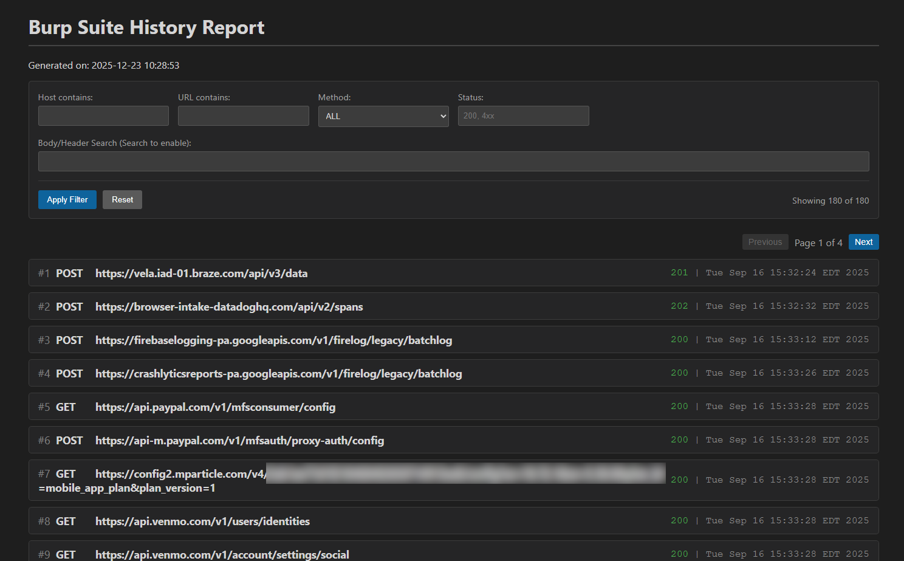
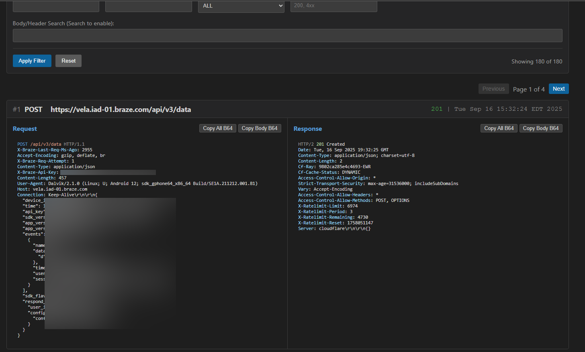
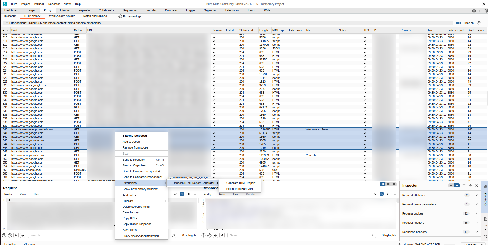

# HTML Report Generator for Burp Suite

A lightweight, high-performance Burp Suite extension that transforms proxy history into a clean, searchable, and interactive HTML report. This generator produces a single-page application (SPA) style report that allows for filtering and deep inspection of HTTP traffic.

*The main interface of the generated HTML report featuring dark mode, filtering, and a clean request list.*

## Features

- **Interactive UI:** A sleek, dark-themed dashboard.
- **Advanced Filtering:** Filter by Host, URL, Method, Status Code, or full-body text search.
- **Smart Formatting:** Automatic syntax highlighting for HTTP and JSON.
- **Browser-Side Decompression:** Automatically handles `gzip` and `deflate` content-encoding directly in the browser so you can read compressed responses without extra steps.
- **Dual Source Support:** 
    - Generate reports directly from selected items in the **Proxy History** or **Target** tabs.
    - Import existing **Burp XML** exports to convert them into the modern HTML format.
- **Clipboard Tools:** Quickly copy full requests/responses or just the bodies as Base64.
- **No Dependencies:** The extension uses the Burp Montoya API and requires no external Java libraries to build.

*Description: Click any request to expand it. You will see formatted headers and body. If the response was Gzipped, the report decompresses it automatically for viewing.*

## How it Works

1. **Extraction:** The extension extracts the raw request/response data from Burp.
2. **Encapsulation:** It wraps the data into a Base64-encoded JSON blob.
3. **Injection:** This data is injected into a pre-defined HTML/JavaScript template.
4. **Rendering:** When you open the report, the JavaScript engine handles pagination (50 items per page for performance) and syntax highlighting on-the-fly.

## Installation

1. **Requirement:** Ensure you are using a modern version of Burp Suite that supports the **Montoya API**.
2. **Build the JAR:**
   - Clone the repository.
   - Run `gradlew clean jar`
   - Alternatively, download the latest `.jar` from the Releases tab.
3. **Load into Burp:**
   - Open Burp Suite.
   - Go to the **Extensions** tab -> **Installed**.
   - Click **Add**.
   - Select **Java** as the extension type and choose the compiled `.jar` file.

## Usage

### Generating from History

*Extension menu inside of proxy tab in BurpSuite*
1. Go to the **Proxy** -> **HTTP History** tab.
2. Select one or more requests.
3. Right-click and select **Generate HTML Report**.
4. Choose a save location.

### Converting Burp XML
1. Right-click anywhere in the Proxy History.
2. Select **Import from Burp XML**.
3. Select your `.xml` file (previously exported from Burp using "Save items" feature with Base64 encoding enabled).
4. The extension will parse the XML and prompt you for a location to save the new HTML report.

## License

This project is licensed under the **MIT License** - see the [LICENSE](LICENSE) file for details.